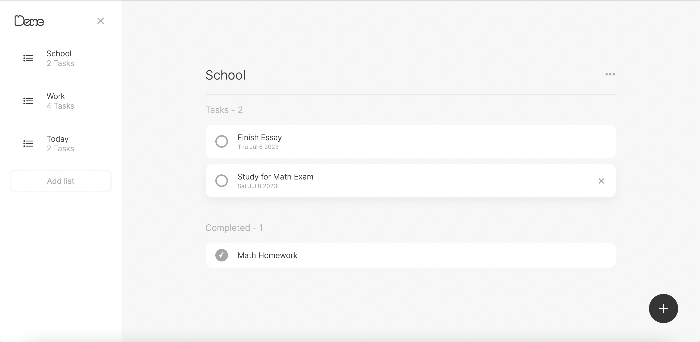

# Done - Todo Lists

Done is a dynamic Todo Lists application that allows users to effectively manage their tasks. This application is built with HTML, CSS, and JavaScript using modern ES6+ syntax and features, including modules and classes. It utilizes IndexedDB for persistent storage of tasks and lists.

## Features

- Users can create multiple task lists for better organization.
- Users can add tasks to each list, with an option to set a due date for each task.
- Tasks can be marked as complete, and completed tasks are separated from incomplete tasks for easy visibility.
- The task counters keep track of the number of tasks that are completed and incomplete.
- Users can delete tasks once they are done.
- All task information is stored persistently in an IndexedDB database, so users won't lose their task lists even after closing the application or refreshing the page.

## Setup and Installation

1. Clone the repository from GitHub.
2. Start a local web server.
3. Open the `index.html` file in a modern web browser.

## Usage

1. Upon launching the application, users can add new lists by clicking the 'Add list' button.
2. To add a task, click the '+' button and fill in the task details, including the task name and the due date.
3. To mark a task as complete, click on the task checkbox. It will then move to the 'Completed' section.
4. To delete a task, click on the x icon on the task card.
5. To delete a list, click on the ellipsis icon (...) next to the list name, and select 'Delete List'.